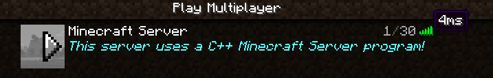

# minecraft-gameserver
C++ Minecraft server

A personal learning project to improve c++ expertise. 

This project is the Shared Library that plugins implement.

C++ Minecraft Server (avg 6ms):

PaperSpigot (avg 2ms):

Main Goals:

- Multithreaded world system
- Plugin system for c++ plugins
- Learning design patterns applications, networking 
- Match the performance of PaperSpigot!

Future testing:

- Stress test
- Vulnerability testing

Documentation will be added later.
