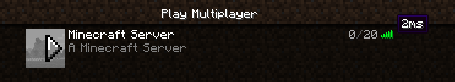

# minecraft-gameserver
C++ Minecraft server

A personal learning project to improve c++ expertise. 

This project is the Shared Library that plugins and the executable implement.

C++ Minecraft Server (avg 2ms):

PaperSpigot (avg 2ms):

Main Goals:

- Multithreaded world system
- Plugin system for c++ plugins
- Learning design patterns applications, networking 
- Match the performance of PaperSpigot!

Future testing:

- Stress test
- Vulnerability testing

Logs:

29/08/2025
- Introduced the concept of Pooled resources, removed the logging on critical locations like readingPackets which were throttling the speed of the ping packet.
- GG we now match Paperspigot ping time speed.

28/08/2025
- Not moving any further with the minecraft server until the network system is optimised.

26/08/2025
- I will need at some point to rewrite the network system to allow buffers to be reused otherwise the constant heap allocations of buffers will hinder perfomance.
- There is a noticeable difference from the first ping to the subsequent pings.

Documentation will be added later.
