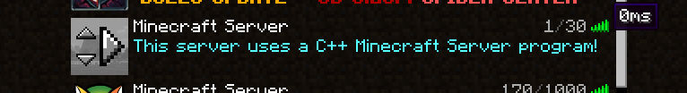

# minecraft-gameserver
C++ Minecraft server

A personal learning project to improve my C++ expertise. 

This project is the Shared Library that plugins and the minecraft-gui implement.

C++ Minecraft Server:

PaperSpigot:

Main Goals:

- Write everything from scratch, no external libraries used
- Multithreading world system (possibly with different world generation algorithms in the future)
- Write a decent API for c++ plugins
- Learning design patterns applications, advanced networking 
- Compete with original java interfaces (spigot,paperspigot,craftbukkit)! A safe haven for the C++ OGs.
- Learn! Learn! Learn!

Testing required:

- Stress test (checking the resilience of the network system)
- Vulnerability testing (buffer overflows and malicious inputs that could crash the server)
- Network , Memory , CPU Profiling

Logs:

25/09/2025
- Event system implemented for the plugins with features like priority and cancellation.

22/09/2025 
- Writing the event system adding the PlayerLoginEvent and ServerListPingEvent equivalents, cleaning up unnecessary headers to improve the API quality

16/09/2025
- Started Login process, fixed the returnContext to return to the correct thread, changed the network architecture for the Minecraft API and made packets handling come from a preAllocated thread_local array to not waste heap allocations. More consistent 0ms pings

08/09/2025
- There is a big issue on the memory_manager.returnContext as the PLAYER_CONNECTION_CONTEXTS are not returning to the correct pool thread. Eventually I will deal with this as it is only relevant after 70+ pings happen.

01/09/2025
- Although there werent significant latency changes in the Ping Pong packet, the server is now written  in a way that is able to handle heavy loads.

30/08/2025
- 3rd time is the charm, watched some c++ trading latency conferences and gained inspiration to rewrite the network system again to introduce more modern c++ features like jthreads, std::pmr for contiguous memory blocks for pooled resources and branch predictability.

29/08/2025
- Introduced the concept of Pooled resources, removed the logging on critical locations like readingPackets which were throttling the speed of the ping packet.
- GG we now match PaperSpigot ping latency.

28/08/2025
- Not moving any further with the minecraft server until the network system is optimised.

26/08/2025
- I will need at some point to rewrite the network system to allow buffers to be reused otherwise the constant heap allocations of buffers will hinder perfomance.
- There is a noticeable difference from the first ping to the subsequent pings.

Documentation will be added later.
